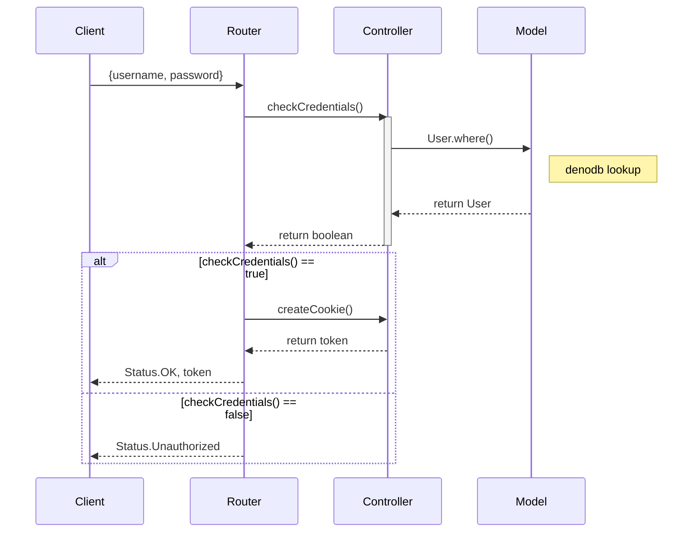

# Server for ConfettiApp

In ConfettiApp people can create spontaneous events and send hearty invitations to their friends.\
The server handles requests from the [confetti_client](https://github.com/cschlusche/confetti_client).

## Technologies / Frameworks / Modules

- [Typescript](https://www.typescriptlang.org/)
- [Deno](https://deno.land/)
  - [oak](https://deno.land/x/oak)
  - [cors](https://deno.land/x/cors)
- [PostgreSQL](https://www.postgresql.org/)
  - [DenoDB](https://deno.land/x/denodb)


```
deno run --allow-net './index.ts'  # run deno
```

## Process login request


